# Learn_AngularJS
Learn_AngularJS

## t1_helloworld

### <a href="t1_helloworld/t1_helloworld.html" target="_blank">t1_helloworld.html</a>

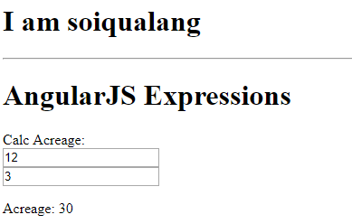

### <a href="t1_helloworld/t2.html" target="_blank">t2.html</a>

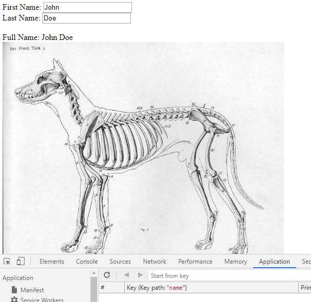

## t2_AngularJS_Expressions

### <a href="t2_AngularJS_Expressions/t1.html" target="_blank">t1.html</a>

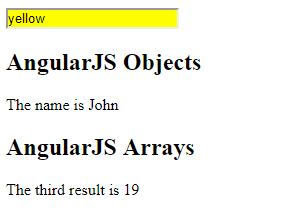

## t3_AngularJS_Modules

### <a href="t3_AngularJS_Modules/t1.html" target="_blank">t1.html</a>

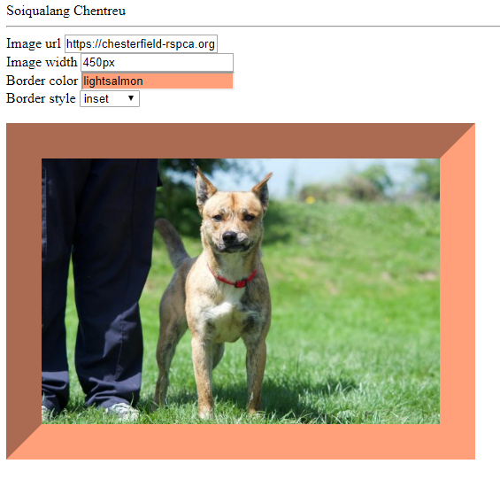

## t4_AngularJS_Directives

### <a href="t4_AngularJS_Directives/t1.html" target="_blank">t1.html</a>

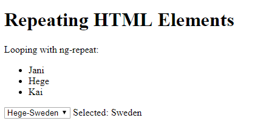

## t5_AngularJS_ng_model_Directive

### <a href="t5_AngularJS_ng_model_Directive/t1.html" target="_blank">t1.html</a>

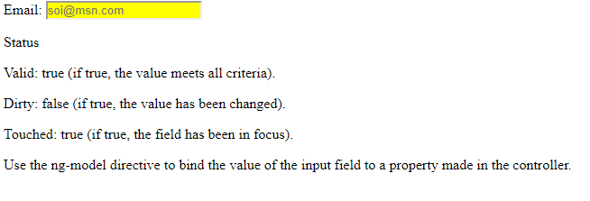

## t6_AngularJS_Data_Binding

### <a href="t6_AngularJS_Data_Binding/t1.html" target="_blank">t1.html</a>

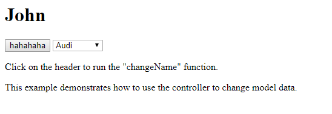

### <a href="t6_AngularJS_Data_Binding/t2.html" target="_blank">t2.html</a>

## t7_AngularJS_Controllers

### <a href="t7_AngularJS_Controllers/t1.html" target="_blank">t1.html</a>

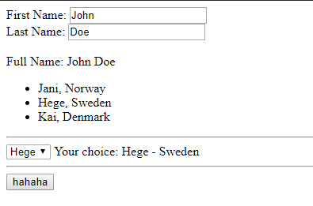

## t8_AngularJS_Scope

### <a href="t8_AngularJS_Scope/t1.html" target="_blank">t1.html</a>

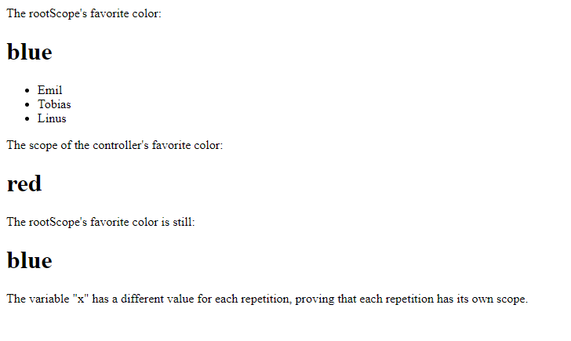

## t9_AngularJS_Filters

### <a href="t9_AngularJS_Filters/t1.html" target="_blank">t1.html</a>

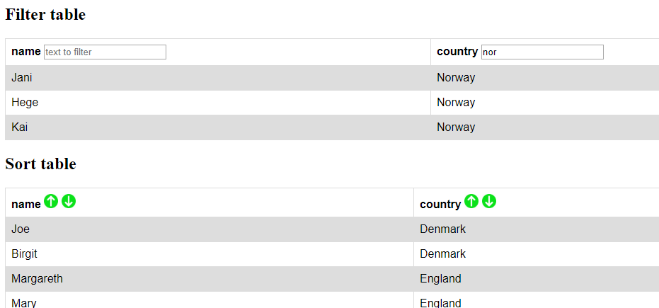

### <a href="t9_AngularJS_Filters/t2.html" target="_blank">t2.html</a>

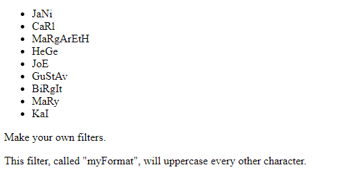

## t10_AngularJS_Services

### <a href="t10_AngularJS_Services/t1.html" target="_blank">t1.html</a>

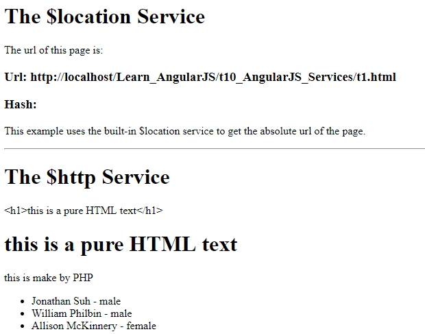
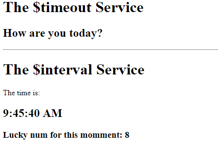

### <a href="t10_AngularJS_Services/t2.html" target="_blank">t2.html</a>

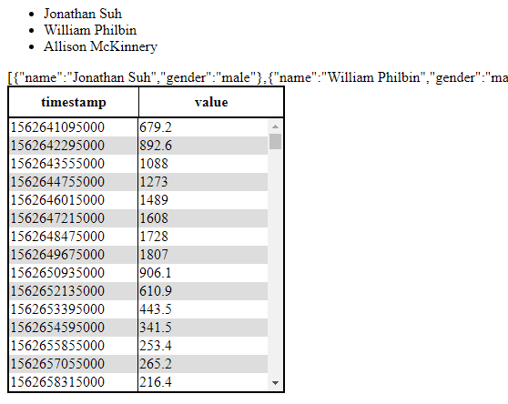

### <a href="t10_AngularJS_Services/t3.html" target="_blank">t3.html</a>

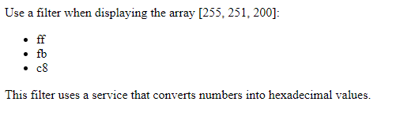

### <a href="t10_AngularJS_Services/t4.html" target="_blank">t4.html</a>

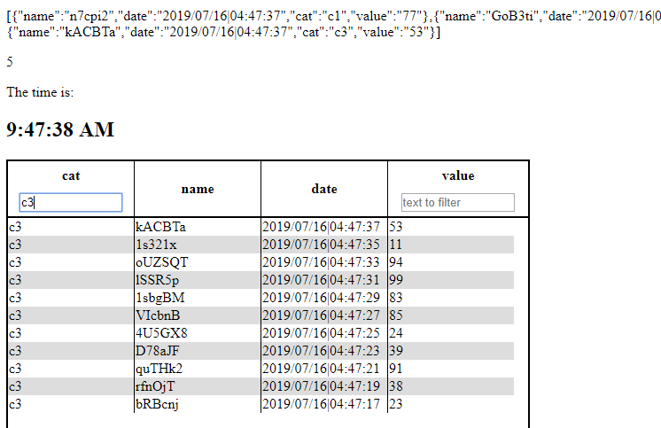
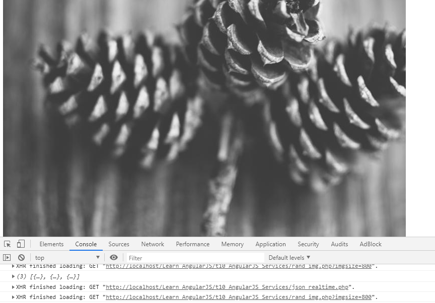

## t10_practice_quotes_app

### <a href="t10_practice_quotes_app/t1.html" target="_blank">t1.html</a>

## t11_AngularJS_HTTP_AJAX

### <a href="t11_AngularJS_HTTP_AJAX/t1.html" target="_blank">t1.html</a>

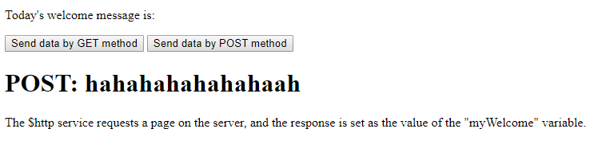

### <a href="t11_AngularJS_HTTP_AJAX/t2.html" target="_blank">t2.html</a>

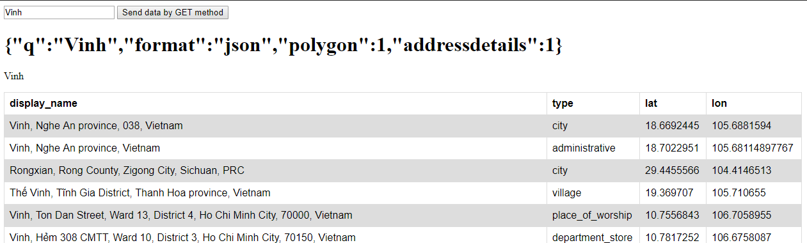

## t12_AngularJS_Tables

### <a href="t12_AngularJS_Tables/t1.html" target="_blank">t1.html</a>

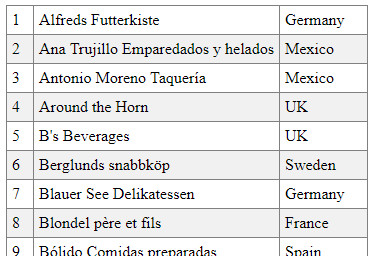

## t13_AngularJS_Select_Boxes

### <a href="t13_AngularJS_Select_Boxes/t1.html" target="_blank">t1.html</a>

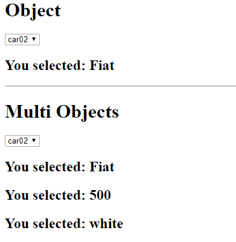

## t14_AngularJS_HTML_DOM

### <a href="t14_AngularJS_HTML_DOM/t1.html" target="_blank">t1.html</a>

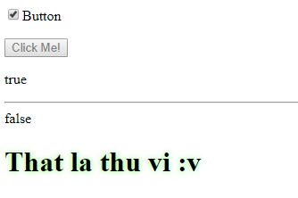

### <a href="t14_AngularJS_HTML_DOM/t2.html" target="_blank">t2.html</a>

## t15_AngularJS_Events

### <a href="t15_AngularJS_Events/t1.html" target="_blank">t1.html</a>

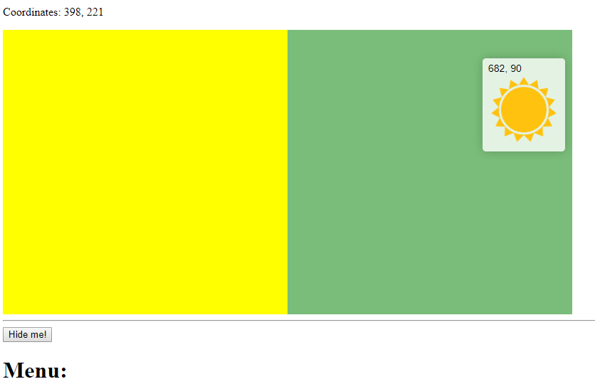

## t16_AngularJS_Forms

### <a href="t16_AngularJS_Forms/t1.html" target="_blank">t1.html</a>

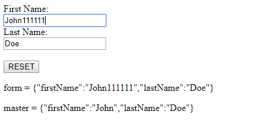

## t17_AngularJS_Form_Validation

### <a href="t17_AngularJS_Form_Validation/t1.html" target="_blank">t1.html</a>

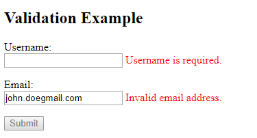

## t18_AngularJS_Includes

### <a href="t18_AngularJS_Includes/t1.html" target="_blank">t1.html</a>

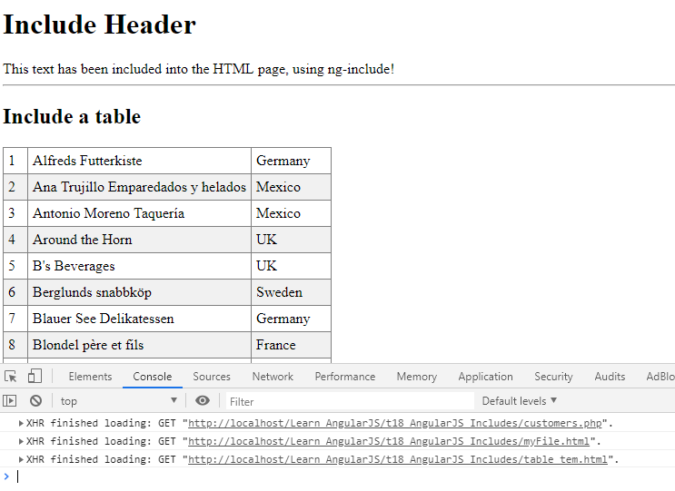

## t19_AngularJS_Routing

### <a href="t19_AngularJS_Routing/t1.html" target="_blank">t1.html</a>

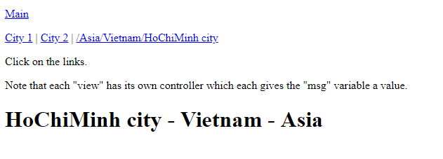

## t20_Make_a_Shopping_List

### <a href="t20_Make_a_Shopping_List/t1.html" target="_blank">t1.html</a>

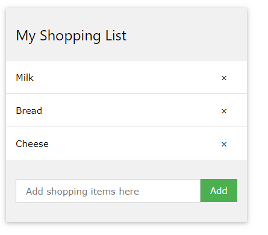

---

https://www.w3schools.com/angular/

https://www.raymondcamden.com/2014/02/07/AngularJS-IndexedDB-Demo

https://static.raymondcamden.com/demos/2014/feb/7/index.html#/home

## Todo

* Create inline grid edit

https://www.w3schools.com/angular/tryit.asp?filename=try_ng_w3css

https://www.tutlane.com/tutorial/angularjs/angularjs-ui-grid-sorting-filtering-paging-grouping