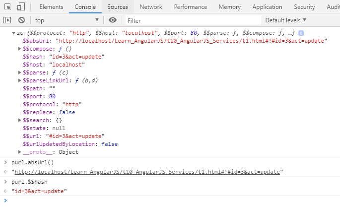
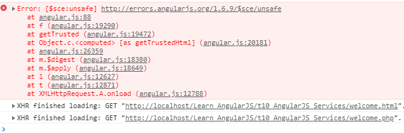

# Learn_AngularJS
AngularJS Services

`http://localhost/Learn_AngularJS/t10_AngularJS_Services/t1.html#!#id=3&act=update`

## $location

## The $http Service

### angular.js:14800 Error: [$sce:unsafe]

Lỗi này do bind một HTML, cách fix xem:

https://github.com/soiqualang/Learn_AngularJS/tree/master/t6_AngularJS_Data_Binding

---

https://www.w3schools.com/angular/