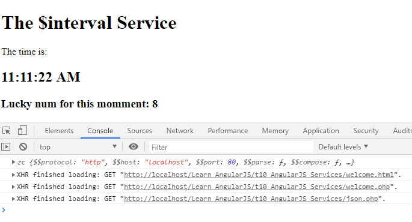
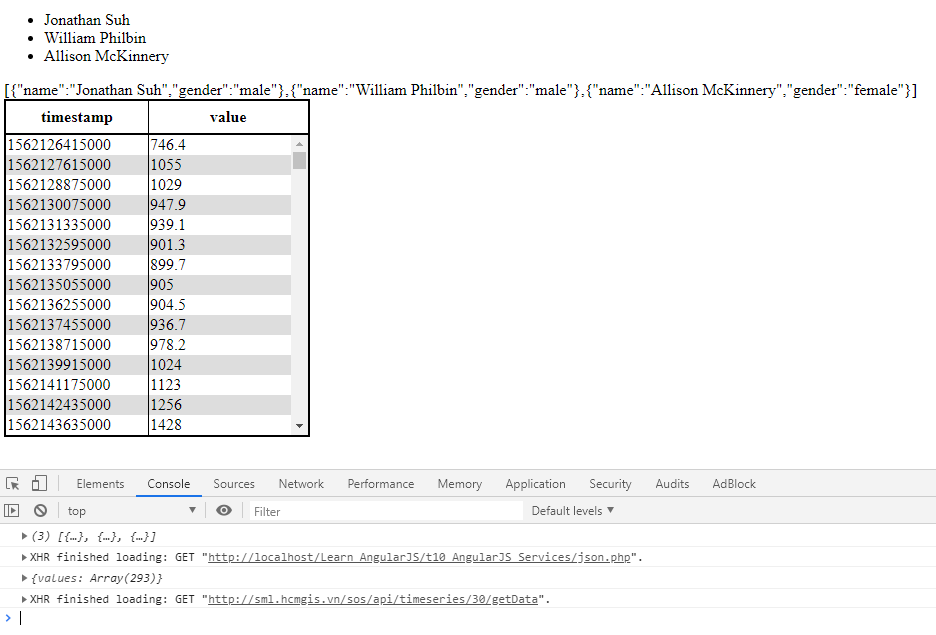
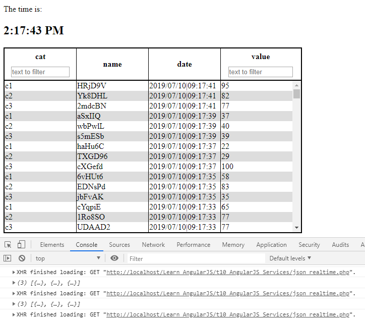

# Learn_AngularJS
AngularJS Services

## t1.html

`http://localhost/Learn_AngularJS/t10_AngularJS_Services/t1.html#!#id=3&act=update`

## $location


## The $http Service

### angular.js:14800 Error: [$sce:unsafe]


Lỗi này do bind một HTML, cách fix xem:

https://github.com/soiqualang/Learn_AngularJS/tree/master/t6_AngularJS_Data_Binding


https://www.w3schools.com/js/tryit.asp?filename=tryjs_random_0_9



## Asynchronous problem

> (Có vẻ như angular hỗ trợ vụ đồng bộ hóa với `$http.get('json.php').then();`

## t2.html - get and parse json

https://jonsuh.com/blog/convert-loop-through-json-php-javascript-arrays-objects/

```php
$someJSON = '[{"name":"Jonathan Suh","gender":"male"},{"name":"William Philbin","gender":"male"},{"name":"Allison McKinnery","gender":"female"}]';
$someArray = json_decode($someJSON, true);
echo json_encode($someArray);
```

### Scroll bar in table

http://jsfiddle.net/hashem/CrSpu/557/

https://stackoverflow.com/questions/17067294/html-table-with-100-width-with-vertical-scroll-inside-tbody/17380697



## t3.html - Use a Custom Service Inside a Filter


## t4.html - Try make a realtime request

Base on:

* t1.html
* t2.html




### unsafe:data

Error when I try to load base64 image from service

fix:

```js
app.config( [
    '$compileProvider',
    function( $compileProvider )
    {   
        $compileProvider.aHrefSanitizationWhitelist(/^\s*(https?|ftp|mailto|chrome-extension):/);
        // Angular before v1.2 uses $compileProvider.urlSanitizationWhitelist(...)
		
		//for img
		$compileProvider.imgSrcSanitizationWhitelist(/^\s*(https?|local|data|chrome-extension):/);
    }
]);
```

and...tada:


https://stackoverflow.com/questions/15606751/angularjs-changes-urls-to-unsafe-in-extension-page

---

https://www.w3schools.com/angular/