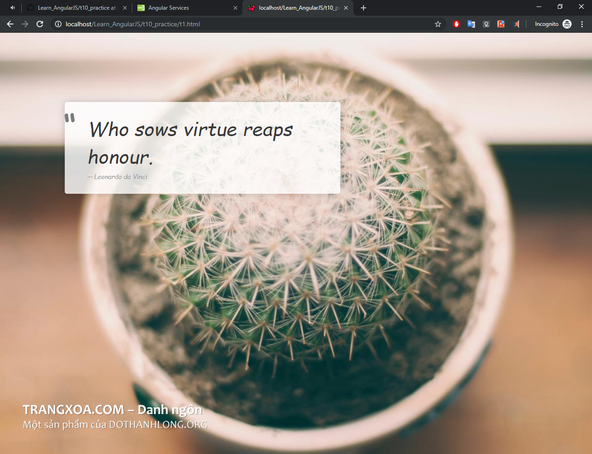
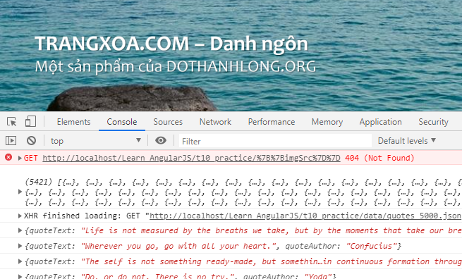

# Learn_AngularJS
Practice AngularJS Services

## Target

Make a dynamic showing quotes

* get and set random backgrond image css
* get and show random quotes

## Database:

https://thewebminer.com/buy-famous-quotes-database

https://github.com/soiqualang/Database-Quotes-JSON

https://planet-source-code.com/vb/scripts/ShowCode.asp?txtCodeId=65205&lngWId=1

http://www.tucows.com/thankyou.html?swid=204716

https://plants.usda.gov/dl_all.html

https://www.kaggle.com/apollonius/usda-plant-database

https://www.plant-image-analysis.org/dataset

http://www.ebusinessgems.com/catalog/

## Preference

https://www.w3schools.com/howto/howto_css_full_page.asp

https://jqueryui.com/draggable/

https://stackoverflow.com/questions/42116554/angular-js-get-random-array-values-on-click

--

https://www.w3schools.com/angular/