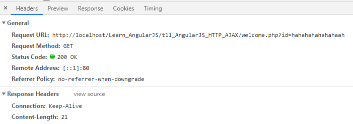

# Learn_AngularJS
AngularJS AJAX - $http

The .get method is a shortcut method of the $http service. There are several shortcut methods:

* .delete()
* .get()
* .head()
* .jsonp()
* .patch()
* .post()
* .put()





## Post and Get method to send data to server

https://stackoverflow.com/questions/13760070/angularjs-passing-data-to-http-get-request

## t2.html - query from service

### Problem

Can't parse other scope value to a scope variable =.=

> => $scope.$watch

```js
//$scope.haha1=$scope.txt1;
	
$scope.haha1='';

$scope.$watch('txt1', function (newValue) {
	$scope.haha1 = 'New value: '+newValue;
});
```


https://nominatim.openstreetmap.org/search?q=nghe%20an&format=json&polygon=1&addressdetails=1


https://stackoverflow.com/questions/36080269/angularjs-how-to-bind-a-scope-variable-to-another-scope-variable
---

https://www.w3schools.com/angular/