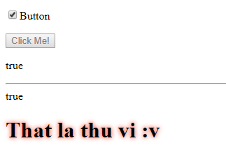
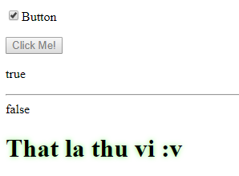
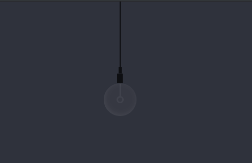

# Learn_AngularJS
AngularJS HTML DOM

* ng-disabled
> The ng-disabled directive binds AngularJS application data to the disabled attribute of HTML elements.

* ng-show, ng-hide
> The ng-show, ng-hide directive shows or hides an HTML element.

## Discover

You can add `!` before expression to get an inverse expression

> You can use any expression that evaluates to true or false:

## h2.html - on/off a lamp

add mouse hover to turn on light =))

---

https://www.w3schools.com/angular/

https://www.raymondcamden.com/2014/02/07/AngularJS-IndexedDB-Demo

https://static.raymondcamden.com/demos/2014/feb/7/index.html#/home

--

https://viblo.asia/p/18-ki-thuat-rut-gon-code-javascript-cua-ban-Qbq5QqRL5D8

https://techblog.vn/bat-cong-tac-bat-tat-den-chi-voi-css3

http://www.300yards.com/007/text-shadow.html

