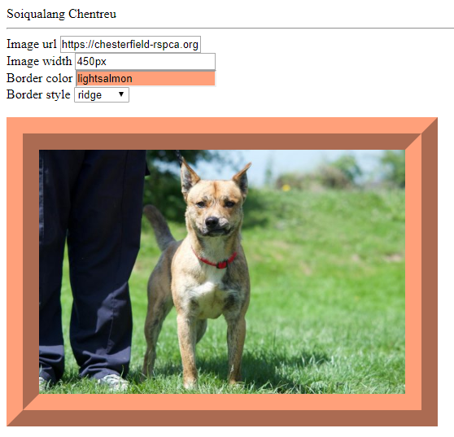

# Learn_AngularJS
Learn_AngularJS

* **An AngularJS module defines an application**.

* The module is a container for the different parts of an application.

* The module is a container for the application controllers.

* Controllers always belong to a module.

## Define a variable

* Define in controller `$scope.txt_color = "yellow";`

## Assign a variable to a input tag

* Use `ng-model` attr

https://www.w3schools.com/angular/

### t1.html

