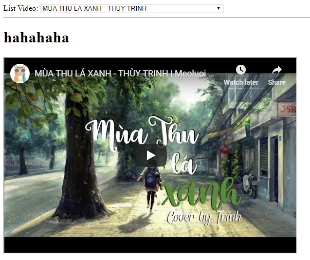

# Learn_AngularJS
Learn_AngularJS

## Event

Pop Events:

* ng-click `ng-click="clickme()"`
* ng-change
* ng-checked

Define functions:

```js
$scope.clickme = function() {
	alert('xin chao');
}
```

## t1.html - test catch events

## t2.html - List youtube video

List Err

* `<iframe src="http://www.youtube.com/embed/{{selected}}"></iframe>`
> $interpolate:noconcat
Multiple Expressions

* `$sce:unsafe Require a safe/trusted value`
> Không thể chèn blind HTML, cần phải

	* `<script src="//ajax.googleapis.com/ajax/libs/angularjs/1.6.9/angular-sanitize.js"></script>`
	
	* `angular.module('myApp', ['...', 'ngSanitize']);`

https://www.w3schools.com/angular/ng_ng-bind-html.asp

https://stackoverflow.com/questions/41996899/angularjs-how-to-resolve-attempting-to-use-an-unsafe-value-in-a-safe-context/41997335


`Vẫn không hỉu sao khi mới load đôi khi frame nạp được url, đôi khi lại không`




https://www.w3schools.com/angular/angular_ref_directives.asp

---
https://www.w3schools.com/angular/