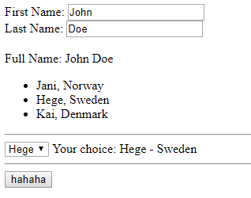

# Learn_AngularJS
Learn_AngularJS

> In AngularJS, $scope is the application object (the owner of application variables and functions).


## Note!

>Error: $compile:ctreq
Missing Required Controller

Khi làm việc với select thì phải có `ng-model`

> Multi Controller in app

```js
var app = angular.module('myApp', []);

app.controller('namesCtrl', function($scope) {
	//bla bla bla
}

app.controller('personCtrl', function($scope) {
	//bla bla bla
}

```

## t1.html

Get text and value of option tag



https://stackoverflow.com/questions/18911458/angularjs-select-value-from-dropdown

---

https://www.w3schools.com/angular/angular_controllers.asp

https://www.w3schools.com/angular/