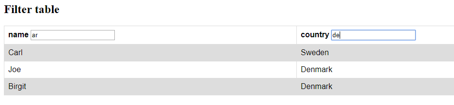

# Learn_AngularJS
AngularJS Filters

> Filters can be added in AngularJS to format data.

AngularJS provides filters to transform data:

* `currency` Format a number to a currency format.
> currency : "NOK " : 3 
* `date` Format a date to a specified format.
* `filter` Select a subset of items from an array.
> filter:'Mar'
(filter on all text)
* `json` Format an object to a JSON string.
* `limitTo` Limits an array/string, into a specified number of elements/characters.
* `lowercase` Format a string to lower case.
> lowercase
* `number` Format a number to a string.
* `orderBy:'country'` Orders an array by an expression.
> orderBy:'country' => asc
> orderBy:'-country' => des
* `uppercase` Format a string to upper case.
> uppercase

## Notes

* Multi filter => just declare more `| filter: bla..`

https://stackoverflow.com/questions/18792039/angularjs-multiple-filter-with-custom-filter-function

---

https://docs.angularjs.org/api/ng/filter/orderBy

https://www.w3schools.com/angular/angular_filters.asp

https://www.w3schools.com/cssref/tryit.asp?filename=trycss_cursor

https://www.w3schools.com/angular/